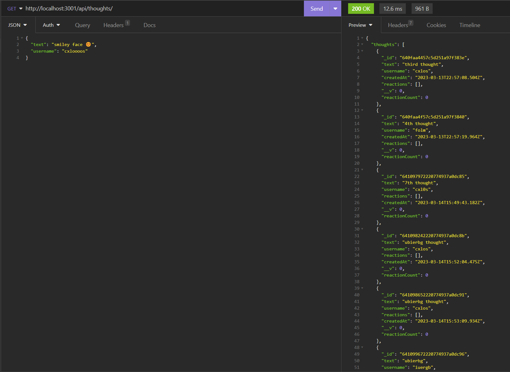

# CxLos18-Social-Network

## Description
```
The Motivation behind this Application was to create a social network platform. I built this project so that users can share their thoughts, add friends, and react to their friends' posts, all in one social media network. It intends to solve the issue of not being able to keep up with your friend's and what is going on in their lives, so we created this app where people can be open and share whatever they want. In building this project, I really got to familiarize myself with MongoDB and how to operate it. I learned how to use the different syntax for creating the routes and how data is stored in it.
```
## Table of Contents 
	
- [Installation](#installation)
- [Usage](#usage)
- [Credits](#credits)
- [License](#license)
- [Badges](#badges)
- [Features](#features)
- [Tests](#tests)


## Installation


## Usage

[Video Walkthrough](https://drive.google.com/file/d/1Ge3KR0RHj-kTQAi5ra4wLipe9P20tH1b/view)

Image


## Badges

N/A

## Features

N/A

## How to Contribute

N/A

## Tests

N/A

## Credits

N/A

## License

MIT License

Copyright (c) 2022 CxLos

Permission is hereby granted, free of charge, to any person obtaining a copy
of this software and associated documentation files (the "Software"), to deal
in the Software without restriction, including without limitation the rights
to use, copy, modify, merge, publish, distribute, sublicense, and/or sell
copies of the Software, and to permit persons to whom the Software is
furnished to do so, subject to the following conditions:

The above copyright notice and this permission notice shall be included in all
copies or substantial portions of the Software.

THE SOFTWARE IS PROVIDED "AS IS", WITHOUT WARRANTY OF ANY KIND, EXPRESS OR
IMPLIED, INCLUDING BUT NOT LIMITED TO THE WARRANTIES OF MERCHANTABILITY,
FITNESS FOR A PARTICULAR PURPOSE AND NONINFRINGEMENT. IN NO EVENT SHALL THE
AUTHORS OR COPYRIGHT HOLDERS BE LIABLE FOR ANY CLAIM, DAMAGES OR OTHER
LIABILITY, WHETHER IN AN ACTION OF CONTRACT, TORT OR OTHERWISE, ARISING FROM,
OUT OF OR IN CONNECTION WITH THE SOFTWARE OR THE USE OR OTHER DEALINGS IN THE
SOFTWARE.
